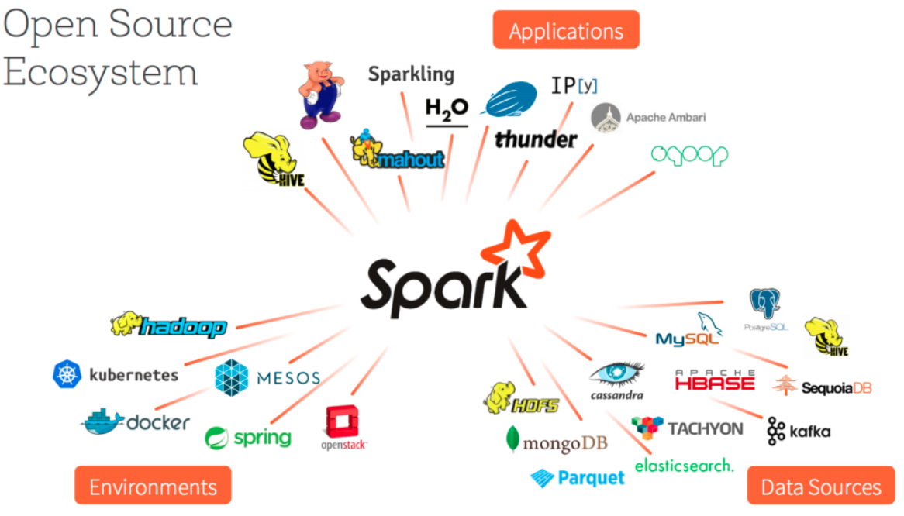

# Introducción a Apache Spark

Apache Spark es una plataforma de computación cluster rápida pensada para ejecutar programas paralelos en cluster con decenas y centenáres de máquinas.

A continuación encontrarás información introductoria con ejercicios prácticas de cada uno de los componentes de Spark.

- [01 - INTRODUCCION A APACHE SPARK](01 - INTRODUCCION A APACHE SPARK.ipynb)
- [02 - RDD RESILENT DISTRIBUTED DATASETS](02 - RDD RESILENT DISTRIBUTED DATASETS.ipynb)
- [03 - RDDs con pares clave valor](03 - RDDs con pares clave valor.ipynb)
- [04 - RDDs numericos](04 - RDDs numericos.ipynb)
- [06 - Lectura y escritura de ficheros](06 - Lectura y escritura de ficheros.ipynb)
- [07 - Ejecucion de un programa Spark y montaje de clusters](07 - Ejecucion de un programa Spark y montaje de clusters.ipynb)
- [08 - DAGs y procesos avanzados en Spark.ipynb](08 - DAGs y procesos avanzados en Spark.ipynb)