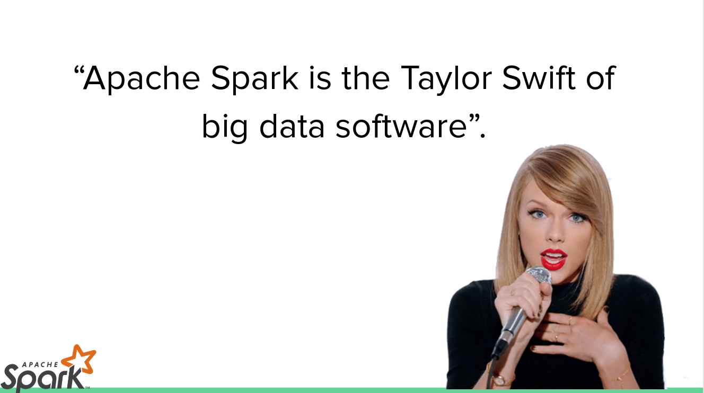

# Introducción a Apache Spark

Apache Spark es una plataforma de computación cluster rápida pensada para ejecutar programas paralelos en cluster con decenas y centenáres de máquinas.

A continuación encontrarás información introductoria con ejercicios prácticas de cada uno de los componentes de Spark.

Enlace a los slides de la presentación [**aquí**](https://docs.google.com/presentation/d/189cQ15l-3ZmmDfHcgc69W_qZONEIb44zJXTlwwe_R-c/edit)

- [01 - INTRODUCCION A APACHE SPARK](https://github.com/xergioalex/apache-spark-introduction/blob/master/01%20-%20INTRODUCCION%20A%20APACHE%20SPARK.ipynb)
- [02 - RDD RESILENT DISTRIBUTED DATASETS](https://github.com/xergioalex/apache-spark-introduction/blob/master/02%20-%20RDD%20RESILENT%20DISTRIBUTED%20DATASETS.ipynb)
- [03 - RDDs con pares clave valor](https://github.com/xergioalex/apache-spark-introduction/blob/master/03%20-%20RDDs%20con%20pares%20clave%20valor.ipynb)
- [04 - RDDs numericos](https://github.com/xergioalex/apache-spark-introduction/blob/master/04%20-%20RDDs%20numericos.ipynb)
- [05 - Persistencia y particionado](https://github.com/xergioalex/apache-spark-introduction/blob/master/05%20-%20Persistencia%20y%20particionado.ipynb)
- [06 - Lectura y escritura de ficheros](https://github.com/xergioalex/apache-spark-introduction/blob/master/06%20-%20Lectura%20y%20escritura%20de%20ficheros.ipynb)
- [07 - Ejecucion de un programa Spark y montaje de clusters](https://github.com/xergioalex/apache-spark-introduction/blob/master/07%20-%20Ejecucion%20de%20un%20programa%20Spark%20y%20montaje%20de%20clusters.ipynb)
- [08 - Spark SQL](https://github.com/xergioalex/apache-spark-introduction/blob/master/08%20-%20Spark%20SQL.ipynb)
- [09 - GraphX Procesamiento de grafos](https://github.com/xergioalex/apache-spark-introduction/blob/master/09%20-%20GraphX%20Procesamiento%20de%20grafos.ipynb)
- [10 - Spark ML](https://github.com/xergioalex/apache-spark-introduction/blob/master/10%20-%20Spark%20ML.ipynb)
- [11 - Spark Streaming](https://github.com/xergioalex/apache-spark-introduction/blob/master/11%20-%20Spark%20Streaming.ipynb)

😂